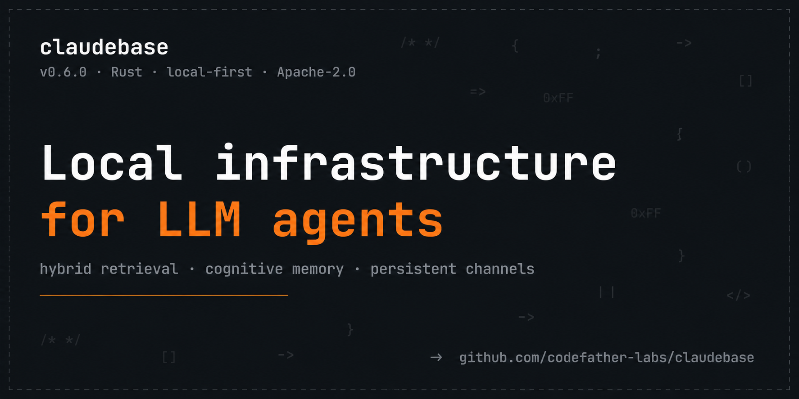
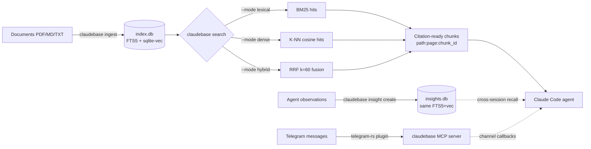

<div align="center">



# `claudebase`

**Local infrastructure for LLM agents.**

Hybrid retrieval over your books · cross-session agent memory · multi-channel orchestration.
Single Rust binary · no Python · no external APIs.

[](https://github.com/codefather-labs/claudebase/actions/workflows/release.yml)
[](https://github.com/codefather-labs/claudebase/releases/latest)
[](LICENSE)
[](https://github.com/codefather-labs/claudebase/releases)
[](https://www.rust-lang.org)

[📖 Docs](docs/) · [📦 Releases](https://github.com/codefather-labs/claudebase/releases) · [💬 Discussions](https://github.com/codefather-labs/claudebase/discussions) · [🤝 Contributing](CONTRIBUTING.md)

</div>

---

## 📦 What is claudebase

`claudebase` is the local **infrastructure layer** that sits next to your Claude Code session and gives the agent four orthogonal capabilities, each independently useful:

```
Layer 4 · Multi-channel orchestration   ← planned (server foundation + transports)
Layer 3 · Plugin runtime                 ← shipping (telegram-rs, future Discord/Slack/Matrix)
Layer 2 · Cross-session agent memory     ← shipping (insights corpus)
Layer 1 · Hybrid retrieval over docs     ← shipping (books corpus)
Layer 0 · Single static Rust binary, local-first
```

Stop at Layer 1 if all you want is RAG. Go to Layer 4 when you want an orchestrator on your phone talking to a fleet of agents on your desktop and cluster.

## ✨ Why claudebase

- 🔍 **Hybrid retrieval** — FTS5 BM25 + 384-dim e5-multilingual-small embeddings, fused via RRF (k=60)
- 🌐 **Multilingual + cross-lingual** — query in English, recall chunks in Russian / Chinese / etc
- 📄 **Per-page PDF navigation** — every hit carries `path:page:chunk_id` so the agent cites verifiable evidence
- 🧠 **Cross-session agent memory** (insights corpus) — hippocampal-replay analogue; agents persist load-bearing observations across sessions
- 💬 **Telegram channel bridge** — Rust port of the official Anthropic plugin, ships from this repo
- 🚀 **`claudebase run`** — one-shot launcher: `claude` with the Telegram channel preset preloaded
- 🔌 **Claude Code MCP plugin** + agent toolkit out of the box (rules, commands, agents)
- ⚡ **Pure local** — single static Rust binary, no Python, no external API calls

## 🚀 Quick install

**Linux / macOS** (one-shot):

```bash
curl -fsSL https://raw.githubusercontent.com/codefather-labs/claudebase/main/install.sh | bash -s -- --yes
```

**Windows** (PowerShell):

```powershell
iwr -useb https://raw.githubusercontent.com/codefather-labs/claudebase/main/install.ps1 | iex
```

**From a local checkout** (contributors):

```bash
git clone https://github.com/codefather-labs/claudebase
cd claudebase
bash install.sh --local --yes      # or .\install.ps1 -Yes -Local on Windows
```

> The installer downloads the pre-built `claudebase` binary + the `telegram-plugin-rs` binary from the latest GitHub release, drops the agent toolkit (rules / commands / agents) into `~/.claude/`, installs PDFium + the e5 encoder cache, best-effort installs `ffmpeg` + `whisper-cli` for voice transcription, and patches the official Anthropic Telegram plugin's cache with our Rust binary. No Rust toolchain required on the install machine.

**Opt-outs** (env vars before running the installer):
- `CLAUDEBASE_SKIP_WHISPER=1` — skip ffmpeg + whisper-cli install (no voice transcription)
- `CLAUDEBASE_SKIP_TELEGRAM=1` — skip Telegram plugin install + patch

## 🎬 Demo

```console
$ claudebase ingest ~/books/clean-architecture.pdf
✓ ingested 1 doc, 387 chunks, 88 pages, 1.2 MB

$ claudebase search "dependency rule" --top-k 3 --mode hybrid
1. clean-architecture.pdf:p88:1247  score=2.87  (BM25=1.92, dense=0.95)
   ...the dependency rule states that source code dependencies must point
   only inward, toward higher-level policies...

2. clean-architecture.pdf:p89:1251  score=1.43  (BM25=0.81, dense=0.62)
   ...

$ claudebase insight create "RRF k=60 outperforms k=40 on 17-PDF corpus" \
    --type agent-learned --agent retrieval-tuning --salience high
{"status":"stored","sha":"a1b2c3d4..."}

$ claudebase insight search "RRF parameters" --salience high --top-k 5
1. doc#42 sha=a1b2c3d4 agent=retrieval-tuning type=agent-learned
   RRF k=60 outperforms k=40 on 17-PDF corpus

$ claudebase run                          # = claude --channels plugin:telegram@claude-plugins-official
$ claudebase run --no-telegram            # = claude (without channel preset)
$ claudebase run -- --debug -c            # forwards extra args verbatim to claude
```

## 🏗 Architecture



| Concern | Implementation |
|---|---|
| Lexical retrieval | SQLite FTS5 BM25 with `unicode61` tokenizer |
| Dense retrieval | `sqlite-vec` v0.1.x vec0 virtual table (L2 over 384-dim unit-norm vectors → cosine-equivalent ranking) |
| Encoder | `intfloat/multilingual-e5-small` ONNX via `fastembed-rs` v5; `passage:` / `query:` prefix discipline enforced |
| Fusion | Reciprocal Rank Fusion with k=60 (Cormack/Clarke/Buttcher 2009) |
| PDF extraction | `pdfium-render` v0.9 (CID fonts, Calibre-converted PDFs, multi-column layouts handled) |
| OCR (image chunks) | `ocr-rs` v2 / PaddleOCR PP-OCRv4 via MNN runtime |
| Books-corpus storage | Single `index.db` SQLite file per project — no co-located figure files; image bytes as BLOB |
| Insights-corpus storage | Separate `insights.db` per project — same engine + an `insights` metadata table (type / agent / salience / feature / session / source-artifact); cascade-deletes through chunks and chunks_vec |
| Telegram bridge | `plugins/telegram-rs/` — Rust port of the official Anthropic plugin (Apache-2.0, single bun-process → single Rust process) |
| Inter-process IPC | UDS today; HTTP/WSS + Bearer-token auth planned (see [`docs/plans/claudebase-server-foundation.md`](docs/plans/claudebase-server-foundation.md)) |

Deep-dive (L2/cosine equivalence math, RRF derivation, e5 prefix asymmetry contract): [`docs/architecture/technical-decisions.md`](docs/architecture/technical-decisions.md). Benchmarks (+75% Recall@5 vs lexical baseline on the 12-query golden set): [`docs/benchmarks/2026-05-10-baseline.md`](docs/benchmarks/2026-05-10-baseline.md).

## 💡 Use cases

| You want… | claudebase gives you |
|---|---|
| LLM agents that remember what they learned across sessions | Insights corpus + `claudebase insight create / search` |
| Claude Code to cite the actual page of the book it's quoting from | Books corpus + per-page navigation via PDFium |
| To chat with your long-running Claude Code session from your phone | Telegram channel plugin + `claudebase run` |
| A fleet of specialised agents on different machines coordinating | Planned: server foundation + agent registry — see [`docs/plans/`](docs/plans/) |
| Local-first RAG without Python, Pinecone, or any external service | Layer 1 alone — `claudebase ingest` + `claudebase search` |

## 📚 Subcommands

**Books corpus** (`index.db`) — user-curated PDF/MD/TXT for RAG-style retrieval:

```text
claudebase ingest <path>                 ingest a file or directory (PDF/MD/TXT)
claudebase search <query> [--mode M]     M ∈ {lexical, dense, hybrid}; default hybrid
                          [--top-k N]    top-K hits (default 5)
                          [--context N]  ±N neighbor chunks per hit (~one page at N=2)
                          [--json]
claudebase compare <query>               A/B-test all 3 modes side-by-side
claudebase page <doc> <N> [--range R]    raw text of page N (or [N-R..N+R]); 1-indexed
claudebase reindex-pages [--doc X]       backfill pages table for legacy v2 indexes
claudebase list                          enumerate indexed sources
claudebase status                        schema_version + doc/chunk counts + db_path
claudebase delete <source-path>          remove a source and its chunks
claudebase warmup [--quiet]              pre-load encoder model (~30s first run)
```

**Insights corpus** (`insights.db`) — agent-written cognitive observations, opt-in per project:

```text
claudebase insight create <body>         persist an agent's cognitive observation
                          --type <kind>  agent-learned | self-bias-caught |
                                         peer-bias-observed | red-team-objection |
                                         consolidator-drift | prediction-error |
                                         assumption-falsified | plan-reality-gap |
                                         reflection-observation | operator-correction
                          --agent <name> emitting agent (planner, reflection, ...)
                          [--feature SLUG] [--salience high|medium|low] [--session ID]
                          [--source-artifact REF]
claudebase insight search <query>        hybrid retrieval over the insights corpus
                          [--mode M] [--top-k N] [--type T] [--agent A]
                          [--salience S] [--feature F] [--since <Nd|Nh|Nm|Nw>]
claudebase insight list                  newest-first, 10 per page
                          [--offset N] [--page-size N] [filters]
claudebase insight random [filters]      uniformly-sampled single insight
claudebase insight get <id|sha-prefix>   fetch one by integer id or ≥4-hex sha prefix
claudebase insight gc [--dry-run]        salience-driven TTL purge + VACUUM
claudebase insight delete <id>           single-row delete with chunks + vec cascade
```

**Hybrid Insights Corpus** (v0.7.0+) — every insight is routed by a mandatory `--category`:

- `--category project` writes to the **per-project local** `<project>/.claude/knowledge/insights.db` (this-project insights — feature work, project-specific lessons).
- `--category general` writes to the **global** `~/.claude/knowledge/insights.db` (cross-project lessons — tools, patterns, anything reusable across projects).

Every `insight create` also requires at least one `--tag` (free-form, e.g. `#nginx`, `#mistakes`, the feature slug). Tags are normalized (`#` stripped, lowercased, deduped) and stored one row per tag in `insight_tags`. Missing `--category` or `--tags` → exit 2. (BREAKING change from v0.6.0 — see CHANGELOG.)

```text
# create — both flags required
claudebase insight create "Tokio mutex held across await deadlocks" \
  --type agent-learned --agent planner --category project --tags tokio,mutex \
  --feature insights-hybrid-corpus --salience high

# create a general / cross-project lesson
claudebase insight create "nginx reload signal is HUP not USR1" \
  --type agent-learned --agent ops --category general --tags nginx,infrastructure --salience medium

# discover the tag vocabulary (merges local + global by default)
claudebase insight tags --json              # [{"tag":"tokio","count":3},...]
claudebase insight tags --category general  # only global db
claudebase insight tags --project some-name # registry lookup + global

# read with tag/category/project filters (OR / any-intersection semantics for multi-tag)
claudebase insight search "race" --tag tokio --tag mutex     # ANY of tokio/mutex
claudebase insight search "deploy" --category general        # global only
claudebase insight list --general-only                       # exclude project insights
claudebase insight list --project-only                       # exclude global insights
```

**Default in-project reads merge local + global** so the agent sees both this-project insights and general lessons. `--general-only` / `--project-only` narrow when needed. Other projects are walled off; cross-project access requires explicit `--project <slug>` which resolves the path via the **project registry** (`~/.claude/knowledge/projects.json`, atomically populated at `claudebase run` startup).

**SessionStart read-on-new-context hook** — when an agent enters a fresh context window, `claudebase-read-insights-reminder.{sh,ps1}` reminds it to discover tags via `insight tags` and pull only relevant insights via `insight search --tag <t>` (not re-read everything).

**Cross-corpus search:**

```text
claudebase search <query> --corpus all   RRF-fuse hits from books and insights
                                         (each hit tagged with source_corpus)
```

**Launcher:**

```text
claudebase run [--no-telegram] [-- args...]    exec `claude` with the Telegram channel
                                               preset preloaded; forwards extra args
```

All subcommands accept `--project-root <dir>` (defaults to cwd) and `--json` for structured output. Insight bodies can come from positional arg, `-`, or piped stdin (TTY without a body is rejected — designed for non-interactive agent use).

## 🧠 Two corpora — books and insights

| | Books corpus (`index.db`) | Insights corpus (`insights.db`) |
|---|---|---|
| **Direction** | Read-side. User feeds it; agents query it. | Write-side. Agents feed it; agents query it (user audits). |
| **Content** | Curated PDFs / Markdown / plain text — books, regulatory docs, internal style guides. | Cognitive observations from agents — drift findings, prediction-errors, peer-bias catches, self-corrections, DMN observations. |
| **Lifecycle** | Stable; changes only when user re-ingests. | Dynamic; grows across every session. `gc` prunes by TTL. |
| **Activation** | Present when `index.db` exists (`claudebase ingest …`). | Opt-in; created on first `insight create`. A project that never adopts it stays byte-identical to one that never heard of it. |
| **Why** | Extend agent expertise with project-specific domain content not in training data. | Persist load-bearing cognitive insights across sessions — without it, every CC session re-discovers what previous sessions already learned. |

### Three-axis taxonomy for insights

The `--type` field is a small open enum, organized along three cognitive axes:

| Axis | `--type` values | When to emit |
|---|---|---|
| **Self-learning** | `agent-learned`, `self-bias-caught` | The agent noticed it learned something new, or caught a blind spot in its own prior reasoning. |
| **Peer-bias / drift detection** | `peer-bias-observed`, `red-team-objection`, `consolidator-drift` | The agent observed a cognitive bias or drift in another agent's output or in upstream artifacts. |
| **Prediction-reality mismatch** | `prediction-error`, `assumption-falsified`, `plan-reality-gap` | Planned / expected / predicted did not match what actually happened (Friston-style prediction error). |
| Special | `reflection-observation`, `operator-correction` | DMN observations from the reflection agent; insights from operator corrections worth carrying forward. |

Factual findings, mechanical execution narration, and generic best-practice claims do **not** belong in the corpus — they go to PRs, scratchpads, or stay silent.

### Salience drives retention

| Salience | Retention | Use for |
|---|---|---|
| `high` | indefinite (never gc'd) | Insights whose loss would degrade the entire pipeline. Use sparingly. |
| `medium` | 365 days | Slice-level or single-decision insights. Default. |
| `low` | 90 days | Ambient / context-setting observations. Cheap to lose. |

Be honest with the tag — marking everything `high` defeats the purge and turns the corpus into a write-only log.

### Books vs insights — which to query for what

| Question | Right corpus |
|---|---|
| "What does the SQL spec say about FTS5?" | books (`claudebase search`) |
| "What did reflection notice last session about the consent flow?" | insights (`claudebase insight search`) |
| "How does Kafka's exactly-once delivery work?" | books |
| "Did a prior planner flag this scope as oversized?" | insights |
| Genuinely spans both | `claudebase search --corpus all` (RRF-fused; each hit tagged with `source_corpus`) |

## 🗺 Roadmap

The next big design milestone is the **multi-CLI agent fleet** — a claudebase server with HTTP/WSS + mandatory Bearer-token auth that hosts the agent registry and routes channel callbacks between cli instances (including TG bot ↔ cli routing). Four plans cover the path end-to-end:

| Plan | Status |
|---|---|
| [`claudebase-server-foundation.md`](docs/plans/claudebase-server-foundation.md) | foundation — HTTP/WSS + auth + OS service install (launchd / systemd / Windows SCM) |
| [`agent-registry-multi-cli.md`](docs/plans/agent-registry-multi-cli.md) | registry + cli↔cli message bus + permission-gated spawn + monitoring |
| [`telegram-multi-cli-orchestration.md`](docs/plans/telegram-multi-cli-orchestration.md) | server-side TG poller + `/agents` `/switch` bot commands + reply-quote routing |
| [`claudebase-project-dir.md`](docs/plans/claudebase-project-dir.md) | per-project `.claudebase/` dir (config.toml + identity.local + state) |

All four are concept-fixed but not yet implemented. Discuss in [GH Discussions](https://github.com/codefather-labs/claudebase/discussions) or open an issue.

## 🆚 Comparison

| | claudebase | lance | chroma | qdrant | vectara |
|---|:---:|:---:|:---:|:---:|:---:|
| Local-first (no external API) | ✅ | ✅ | ✅ | ✅ (self-host) | ❌ |
| Single static binary | ✅ | ❌ (Python) | ❌ (Python) | ❌ (Go + Python) | n/a |
| Hybrid retrieval (BM25 + dense + RRF) | ✅ | partial | partial | partial | ✅ |
| Per-page PDF citations | ✅ | ❌ | ❌ | ❌ | ❌ |
| Cross-session agent memory | ✅ (insights corpus) | ❌ | ❌ | ❌ | ❌ |
| Claude Code MCP plugin | ✅ | ❌ | ❌ | ❌ | ❌ |
| Telegram channel bridge | ✅ | ❌ | ❌ | ❌ | ❌ |
| Multilingual / cross-lingual recall | ✅ (e5) | depends on chosen embedder | depends on chosen embedder | depends on chosen embedder | ✅ |
| Engine | SQLite + FTS5 + sqlite-vec | columnar (LanceDB) | DuckDB / SQLite | custom vector engine | hosted |

Different tools, different sweet spots. claudebase aims at the **agent-infrastructure** niche specifically.

## 📂 Repository layout

```
claudebase/
├── src/                    Rust source (cli, store, search, ingest, encoder, ocr, pdf, ...)
├── tests/                  Integration tests + fixtures
├── plugins/
│   └── telegram-rs/        Rust port of the official Anthropic Telegram channel plugin
├── prompts/                Claude Code agent toolkit installed into ~/.claude/
│   ├── rules/              knowledge-base, knowledge-base-tool, tool-limitations
│   ├── commands/           /knowledge-ingest, /reflect, /consolidate, /update-claudebase
│   └── agents/             reflection (Drift), consolidator (Mnem)
├── bench/                  Benchmark harness + golden query set
├── docs/                   Self-contained product documentation
│   ├── PRD.md              Product requirements
│   ├── design.md           System design
│   ├── architecture/       Stack rationale + math
│   ├── benchmarks/         Golden-set numbers
│   └── plans/              Forward-looking design docs (roadmap items)
├── .github/                Issue templates, PR template, workflows
├── Cargo.toml              Workspace root: claudebase + plugins/telegram-rs members
├── install.sh / install.ps1   Cross-platform installer
├── CONTRIBUTING.md / SECURITY.md / CODE_OF_CONDUCT.md / CHANGELOG.md
├── RELEASING.md            Release procedure (tag claudebase-vX.Y.Z → workflow → GH release)
├── LICENSE                 MIT
└── README.md               This file
```

## 🔗 Companion repo

For the documentation-first TDD pipeline that uses claudebase as its memory + observation infrastructure — 19 specialist agents plus the orchestrator persona Mira — install [`claude-code-sdlc`](https://github.com/codefather-labs/claude-code-sdlc). Its installer chains to this one; either repo can also be installed standalone.

## 🤝 Contributing

See [CONTRIBUTING.md](CONTRIBUTING.md). Open-ended ideas → [Discussions](https://github.com/codefather-labs/claudebase/discussions). Security vulnerabilities → [SECURITY.md](SECURITY.md) (private disclosure, do not open public issues).

## 📜 License + history

MIT — see [LICENSE](LICENSE).

`claudebase` was extracted from the [`claude-code-sdlc`](https://github.com/codefather-labs/claude-code-sdlc) monorepo's `tools/sdlc-knowledge/` crate on 2026-05-10. The CLI was renamed from `claudeknows` to `claudebase` at the same time. Versioning continues from the last `sdlc-knowledge` release: claudebase v0.4.0 succeeded sdlc-knowledge v0.4.0 directly. Pre-extraction history lives in the SDLC monorepo's git log up to commit [`ca3ecb5`](https://github.com/codefather-labs/claude-code-sdlc/commit/ca3ecb5).

## 🙏 Acknowledgments

Built on [`sqlite-vec`](https://github.com/asg017/sqlite-vec), [`fastembed-rs`](https://github.com/Anush008/fastembed-rs), [`pdfium-render`](https://github.com/ajrcarey/pdfium-render), [`ocr-rs`](https://github.com/ChunelFeng/ocr-rs) / [PaddleOCR](https://github.com/PaddlePaddle/PaddleOCR), [`tracing`](https://github.com/tokio-rs/tracing), [`tokio`](https://github.com/tokio-rs/tokio), and the [official Anthropic Telegram plugin](https://github.com/anthropics/claude-plugins-official) (Apache-2.0 — see `plugins/telegram-rs/NOTICE` for attribution).
