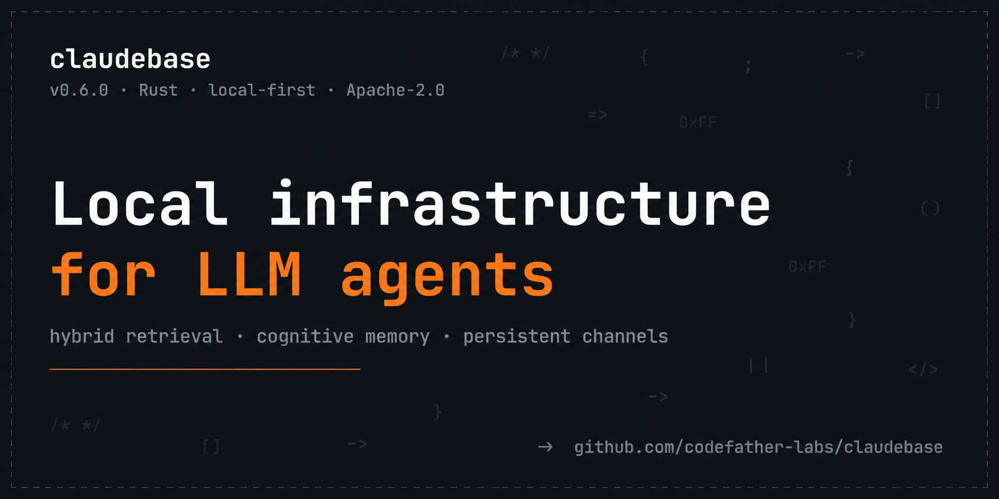
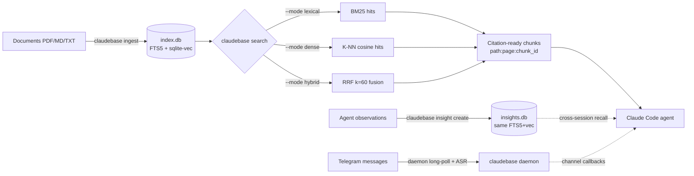

<div align="center">



# `claudebase`

**Local infrastructure for LLM agents.**

Hybrid retrieval over your books · cross-session agent memory · multi-channel orchestration.
Single Rust binary · no Python · no external APIs.

[](https://github.com/codefather-labs/claudebase/actions/workflows/release.yml)
[](https://github.com/codefather-labs/claudebase/releases/latest)
[](LICENSE)
[](https://github.com/codefather-labs/claudebase/releases)
[](https://www.rust-lang.org)

[📖 Docs](docs/) · [📦 Releases](https://github.com/codefather-labs/claudebase/releases) · [💬 Discussions](https://github.com/codefather-labs/claudebase/discussions) · [🤝 Contributing](CONTRIBUTING.md)

</div>

---

## 📦 What is claudebase

`claudebase` is the local **infrastructure layer** that sits next to your Claude Code session and gives the agent four orthogonal capabilities, each independently useful:

```
Layer 4 · Multi-channel orchestration   ← planned (server foundation + transports)
Layer 3 · Channel transport              ← shipping (Telegram in-daemon; Discord/Slack/Matrix next)
Layer 2 · Cross-session agent memory     ← shipping (insights corpus)
Layer 1 · Hybrid retrieval over docs     ← shipping (books corpus)
Layer 0 · Single static Rust binary, local-first
```

Stop at Layer 1 if all you want is RAG. Go to Layer 4 when you want an orchestrator on your phone talking to a fleet of agents on your desktop and cluster.

## ✨ Why claudebase

- 🔍 **Hybrid retrieval** — FTS5 BM25 + 384-dim e5-multilingual-small embeddings, fused via RRF (k=60)
- 🌐 **Multilingual + cross-lingual** — query in English, recall chunks in Russian / Chinese / etc
- 📄 **Per-page PDF navigation** — every hit carries `path:page:chunk_id` so the agent cites verifiable evidence
- 🧠 **Cross-session agent memory** (insights corpus) — hippocampal-replay analogue; agents persist load-bearing observations across sessions
- 💬 **Telegram built into the daemon** — no Claude Code plugin, no MCP channel, nothing a CLI update can break
- 🚀 **`claudebase run`** — PTY supervisor: runs `claude` unmodified and injects inbound messages into its input
- 🔌 **Agent toolkit out of the box** (rules, commands, agents, hooks)
- ⚡ **Pure local** — single static Rust binary, no Python, no external API calls

## 🚀 Quick install

**Linux / macOS** (one-shot):

```bash
curl -fsSL https://raw.githubusercontent.com/codefather-labs/claudebase/main/install.sh | bash -s -- --yes
```

**Windows** (PowerShell):

```powershell
iwr -useb https://raw.githubusercontent.com/codefather-labs/claudebase/main/install.ps1 | iex
```

**From a local checkout** (contributors):

```bash
git clone https://github.com/codefather-labs/claudebase
cd claudebase
bash install.sh --local --yes      # or .\install.ps1 -Yes -Local on Windows
```

> The installer downloads the pre-built `claudebase` binary from the latest GitHub release, drops the agent toolkit (rules / commands / agents / hooks) into `~/.claude/`, installs PDFium + the e5 encoder cache, best-effort installs `ffmpeg` + `whisper-cli` for voice transcription, and registers the daemon as a user service. It does NOT touch Claude Code's plugins. No Rust toolchain required on the install machine.

**Supported binary platforms** (release matrix):
- **macOS**: arm64 only (M1/M2/M3/M4+). **Intel Mac (`x86_64-apple-darwin`) deprecated as of v0.7.1** — `ort 2.0.0-rc.12` stopped shipping prebuilt binaries for that target. If you're on Intel Mac, either run the Linux binary under Rosetta-via-VM, or build from source: `cargo install --path .` (requires Rust toolchain).
- **Linux**: x64 + arm64.
- **Windows**: x64.

**Opt-outs** (env vars before running the installer):
- `CLAUDEBASE_VERSION=x.y.z` — pin a specific version (downgrade, repeatable CI installs). Default: latest `claudebase-v*` tag on origin (via `git ls-remote`, no API quota). Falls back to a baked-in constant if the remote lookup fails (air-gapped / GitHub unreachable).
- `CLAUDEBASE_SKIP_WHISPER=1` — skip ffmpeg + whisper-cli install (no voice transcription)

## 🎬 Demo

```console
$ claudebase ingest ~/books/clean-architecture.pdf
✓ ingested 1 doc, 387 chunks, 88 pages, 1.2 MB

$ claudebase search "dependency rule" --top-k 3 --mode hybrid
1. clean-architecture.pdf:p88:1247  score=2.87  (BM25=1.92, dense=0.95)
   ...the dependency rule states that source code dependencies must point
   only inward, toward higher-level policies...

2. clean-architecture.pdf:p89:1251  score=1.43  (BM25=0.81, dense=0.62)
   ...

$ claudebase insight create "RRF k=60 outperforms k=40 on 17-PDF corpus" \
    --type agent-learned --agent retrieval-tuning \
    --category general --tags rrf,retrieval --salience high
{"status":"stored","sha":"a1b2c3d4..."}

$ claudebase insight search "RRF parameters" --salience high --top-k 5
1. doc#42 sha=a1b2c3d4 agent=retrieval-tuning type=agent-learned
   RRF k=60 outperforms k=40 on 17-PDF corpus

$ claudebase run                          # `claude` under a PTY supervisor; Telegram + peer messages arrive in its input
$ claudebase run --no-telegram            # plain `claude`, no supervisor, no inbound messages
$ claudebase run -- --debug -c            # forwards extra args verbatim to claude
```

## 🏗 Architecture


```mermaid
graph LR
    A[Documents PDF/MD/TXT] -->|claudebase ingest| B[(index.db<br/>FTS5 + sqlite-vec)]
    B --> C{claudebase search}
    C -->|--mode lexical| D[BM25 hits]
    C -->|--mode dense| E[K-NN cosine hits]
    C -->|--mode hybrid| F[RRF k=60 fusion]
    D --> G[Citation-ready chunks<br/>path:page:chunk_id]
    E --> G
    F --> G
    G --> H[Claude Code agent]
    I[Agent observations] -->|claudebase insight create| J[(insights.db<br/>same FTS5+vec)]
    J -.cross-session recall.-> H
    K[Telegram messages] -->|daemon long-poll + ASR| L[claudebase daemon]
    L -.channel callbacks.-> H
```

| Concern | Implementation |
|---|---|
| Lexical retrieval | SQLite FTS5 BM25 with `unicode61` tokenizer |
| Dense retrieval | `sqlite-vec` v0.1.x vec0 virtual table (L2 over 384-dim unit-norm vectors → cosine-equivalent ranking) |
| Encoder | `intfloat/multilingual-e5-small` ONNX via `fastembed-rs` v5; `passage:` / `query:` prefix discipline enforced |
| Fusion | Reciprocal Rank Fusion with k=60 (Cormack/Clarke/Buttcher 2009) |
| PDF extraction | `pdfium-render` v0.9 (CID fonts, Calibre-converted PDFs, multi-column layouts handled) |
| OCR (image chunks) | `ocr-rs` v2 / PaddleOCR PP-OCRv4 via MNN runtime |
| Books-corpus storage | Single `index.db` SQLite file per project — no co-located figure files; image bytes as BLOB |
| Insights-corpus storage | Separate `insights.db` per project — same engine + an `insights` metadata table (type / agent / salience / feature / session / source-artifact); cascade-deletes through chunks and chunks_vec |
| Telegram bridge | `src/daemon/telegram.rs` — long-poll, ASR and outbound queue inside the daemon; no external plugin |
| Inter-process IPC | UDS (named pipe on Windows), length-prefixed JSON frames; TCP + pre-shared-key auth designed in Slice 9 of [`the v0.10 plan`](docs/plans/claudebase-v0.10-pty-transport.md) |

Deep-dive (L2/cosine equivalence math, RRF derivation, e5 prefix asymmetry contract): [`docs/architecture/technical-decisions.md`](docs/architecture/technical-decisions.md). Benchmarks (+75% Recall@5 vs lexical baseline on the 12-query golden set): [`docs/benchmarks/2026-05-10-baseline.md`](docs/benchmarks/2026-05-10-baseline.md).

## 💡 Use cases

| You want… | claudebase gives you |
|---|---|
| LLM agents that remember what they learned across sessions | Insights corpus + `claudebase insight create / search` |
| Claude Code to cite the actual page of the book it's quoting from | Books corpus + per-page navigation via PDFium |
| To chat with your long-running Claude Code session from your phone | `claudebase telegram addbot` + `claudebase run` |
| A fleet of specialised agents on different machines coordinating | Planned: server foundation + agent registry — see [`docs/plans/`](docs/plans/) |
| Local-first RAG without Python, Pinecone, or any external service | Layer 1 alone — `claudebase ingest` + `claudebase search` |

## 📚 Subcommands

**Books corpus** (`index.db`) — user-curated PDF/MD/TXT for RAG-style retrieval:

```text
claudebase ingest <path>                 ingest a file or directory (PDF/MD/TXT)
claudebase search <query> [--mode M]     M ∈ {lexical, dense, hybrid}; default hybrid
                          [--top-k N]    top-K hits (default 5)
                          [--context N]  ±N neighbor chunks per hit (~one page at N=2)
                          [--json]
claudebase compare <query>               A/B-test all 3 modes side-by-side
claudebase page <doc> <N> [--range R]    raw text of page N (or [N-R..N+R]); 1-indexed
claudebase reindex-pages [--doc X]       backfill pages table for legacy v2 indexes
claudebase list                          enumerate indexed sources
claudebase status                        schema_version + doc/chunk counts + db_path
claudebase delete <source-path>          remove a source and its chunks
claudebase warmup [--quiet]              pre-load encoder model (~30s first run)
```

**Insights corpus** (`insights.db`) — agent-written cognitive observations, opt-in per project:

```text
claudebase insight create <body>         persist an agent's cognitive observation
                          --type <kind>  agent-learned | self-bias-caught |
                                         peer-bias-observed | red-team-objection |
                                         consolidator-drift | prediction-error |
                                         assumption-falsified | plan-reality-gap |
                                         reflection-observation | operator-correction
                          --agent <name> emitting agent (planner, reflection, ...)
                          --category <general|project>  REQUIRED (v0.7.0+): general
                                         routes to the global $HOME/.claude/knowledge/
                                         insights.db; project routes to the per-project
                                         local insights.db. Missing -> exit 2.
                          --tags <t,..>  REQUIRED (v0.7.0+, >=1): comma-separated
                                         free-form tags (e.g. nginx, mistakes, feature
                                         slug). Normalized (# stripped, lowercased,
                                         deduped). Missing -> exit 2.
                          [--feature SLUG] [--salience high|medium|low] [--session ID]
                          [--source-artifact REF]
claudebase insight tags                  list distinct tag vocabulary with counts
                          [--category C] [--project SLUG] [--json]
                                         default merges local + global; --category
                                         narrows; --project does registry lookup
claudebase insight search <query>        hybrid retrieval over the insights corpus
                          [--mode M] [--top-k N] [--type T] [--agent A]
                          [--salience S] [--feature F] [--since <Nd|Nh|Nm|Nw>]
                          [--tag T ...]  OR/any-intersection filter (v0.7.0+):
                                         repeatable; an insight is returned if its
                                         tag set intersects the requested tags by
                                         at least one
                          [--category C] [--project SLUG]
                          [--general-only|--project-only]
                                         in-project default = merge(local, global);
                                         narrowing flags exclude the other leg
claudebase insight list                  newest-first, 10 per page
                          [--offset N] [--page-size N] [filters]
claudebase insight random [filters]      uniformly-sampled single insight
claudebase insight get <id|sha-prefix>   fetch one by integer id or ≥4-hex sha prefix
claudebase insight gc [--dry-run]        salience-driven TTL purge + VACUUM
claudebase insight delete <id>           single-row delete with chunks + vec cascade
```

**Hybrid Insights Corpus** (v0.7.0+) — every insight is routed by a mandatory `--category`:

- `--category project` writes to the **per-project local** `<project>/.claude/knowledge/insights.db` (this-project insights — feature work, project-specific lessons).
- `--category general` writes to the **global** `~/.claude/knowledge/insights.db` (cross-project lessons — tools, patterns, anything reusable across projects).

Every `insight create` also requires at least one `--tag` (free-form, e.g. `#nginx`, `#mistakes`, the feature slug). Tags are normalized (`#` stripped, lowercased, deduped) and stored one row per tag in `insight_tags`. Missing `--category` or `--tags` → exit 2. (BREAKING change from v0.6.0 — see CHANGELOG.)

```text
# create — both flags required
claudebase insight create "Tokio mutex held across await deadlocks" \
  --type agent-learned --agent planner --category project --tags tokio,mutex \
  --feature insights-hybrid-corpus --salience high

# create a general / cross-project lesson
claudebase insight create "nginx reload signal is HUP not USR1" \
  --type agent-learned --agent ops --category general --tags nginx,infrastructure --salience medium

# discover the tag vocabulary (merges local + global by default)
claudebase insight tags --json              # [{"tag":"tokio","count":3},...]
claudebase insight tags --category general  # only global db
claudebase insight tags --project some-name # registry lookup + global

# read with tag/category/project filters (OR / any-intersection semantics for multi-tag)
claudebase insight search "race" --tag tokio --tag mutex     # ANY of tokio/mutex
claudebase insight search "deploy" --category general        # global only
claudebase insight list --general-only                       # exclude project insights
claudebase insight list --project-only                       # exclude global insights
```

**Default in-project reads merge local + global** so the agent sees both this-project insights and general lessons. `--general-only` / `--project-only` narrow when needed. Other projects are walled off; cross-project access requires explicit `--project <slug>` which resolves the path via the **project registry** (`~/.claude/knowledge/projects.json`, atomically populated at `claudebase run` startup).

**SessionStart read-on-new-context hook** — when an agent enters a fresh context window, `claudebase-read-insights-reminder.{sh,ps1}` reminds it to discover tags via `insight tags` and pull only relevant insights via `insight search --tag <t>` (not re-read everything).

**Cross-corpus search:**

```text
claudebase search <query> --corpus all   RRF-fuse hits from books and insights
                                         (each hit tagged with source_corpus)
```

**Launcher:**

```text
claudebase run [--no-telegram] [-- args...]    run `claude` under the PTY supervisor
                                               preset preloaded; forwards extra args
```

All subcommands accept `--project-root <dir>` (defaults to cwd) and `--json` for structured output. Insight bodies can come from positional arg, `-`, or piped stdin (TTY without a body is rejected — designed for non-interactive agent use).

## 🧠 Two corpora — books and insights

| | Books corpus (`index.db`) | Insights corpus (`insights.db`) |
|---|---|---|
| **Direction** | Read-side. User feeds it; agents query it. | Write-side. Agents feed it; agents query it (user audits). |
| **Content** | Curated PDFs / Markdown / plain text — books, regulatory docs, internal style guides. | Cognitive observations from agents — drift findings, prediction-errors, peer-bias catches, self-corrections, DMN observations. |
| **Lifecycle** | Stable; changes only when user re-ingests. | Dynamic; grows across every session. `gc` prunes by TTL. |
| **Activation** | Present when `index.db` exists (`claudebase ingest …`). | Opt-in; created on first `insight create`. A project that never adopts it stays byte-identical to one that never heard of it. |
| **Why** | Extend agent expertise with project-specific domain content not in training data. | Persist load-bearing cognitive insights across sessions — without it, every CC session re-discovers what previous sessions already learned. |

### Three-axis taxonomy for insights

The `--type` field is a small open enum, organized along three cognitive axes:

| Axis | `--type` values | When to emit |
|---|---|---|
| **Self-learning** | `agent-learned`, `self-bias-caught` | The agent noticed it learned something new, or caught a blind spot in its own prior reasoning. |
| **Peer-bias / drift detection** | `peer-bias-observed`, `red-team-objection`, `consolidator-drift` | The agent observed a cognitive bias or drift in another agent's output or in upstream artifacts. |
| **Prediction-reality mismatch** | `prediction-error`, `assumption-falsified`, `plan-reality-gap` | Planned / expected / predicted did not match what actually happened (Friston-style prediction error). |
| Special | `reflection-observation`, `operator-correction` | DMN observations from the reflection agent; insights from operator corrections worth carrying forward. |

Factual findings, mechanical execution narration, and generic best-practice claims do **not** belong in the corpus — they go to PRs, scratchpads, or stay silent.

### Salience drives retention

| Salience | Retention | Use for |
|---|---|---|
| `high` | indefinite (never gc'd) | Insights whose loss would degrade the entire pipeline. Use sparingly. |
| `medium` | 365 days | Slice-level or single-decision insights. Default. |
| `low` | 90 days | Ambient / context-setting observations. Cheap to lose. |

Be honest with the tag — marking everything `high` defeats the purge and turns the corpus into a write-only log.

### Books vs insights — which to query for what

| Question | Right corpus |
|---|---|
| "What does the SQL spec say about FTS5?" | books (`claudebase search`) |
| "What did reflection notice last session about the consent flow?" | insights (`claudebase insight search`) |
| "How does Kafka's exactly-once delivery work?" | books |
| "Did a prior planner flag this scope as oversized?" | insights |
| Genuinely spans both | `claudebase search --corpus all` (RRF-fused; each hit tagged with `source_corpus`) |

## 💬 Telegram — setup and the message contract

One bot, many Claude Code sessions. The daemon is the single Telegram poller; each chat is routed to
one session. **No Claude Code plugin is involved** — inbound messages are written straight into the
session's input, and replies go out through the CLI. That is deliberate: the plugin/channel path
broke on every Claude Code update, and the terminal does not.

### Setup

```bash
claudebase telegram addbot "<token from @BotFather>"   # verified via getMe, stored in chat.db
claudebase daemon restart                              # the daemon reads the registry at boot
claudebase telegram get_me                             # raw Telegram API response, to confirm
```

Then message the bot. Under the default `pairing` policy the first message from an unknown sender is
held and the bot replies with a code:

```bash
claudebase telegram access            # policy, allowlist, pending codes
claudebase telegram pair <code>       # approve
claudebase telegram policy allowlist  # close the door once everyone is in
```

`pairing` is a bootstrap mode, not a resting state — it lets any stranger trigger a code. Switch to
`allowlist` when the list is complete (the command refuses if that would lock you out of an empty
list).

### The message contract

Inbound messages appear in the session's input as a prefixed line:

```text
[telegram_message]: what the operator sent
[agent-to-agent:mira]: what a peer session sent
```

The prefix says two things: this is a MESSAGE rather than something the operator typed at the
prompt, and — for peer traffic — who sent it. **The sender cannot see the terminal**, so a reply
only reaches them through a command:

```bash
claudebase telegram send --text "reply to the operator"
claudebase telegram send --stdin                        # multi-line body
claudebase agent send "reply" --agent_nick <nick>       # reply to a peer session
```

No destination argument is needed for Telegram: it resolves from the session's binding, then from
the only known chat, and refuses with a candidate list if that is ambiguous. Every claudebase-aware
session gets this contract injected at SessionStart by the `claudebase-channel-contract` hook, so
the agent knows it before the first message arrives.

### Bot command reference

| Command | Effect |
|---|---|
| `/agents` | List sessions currently online and registered with the daemon. |
| `/switch <name>` | Rebind this chat to the named session. |
| `/whoami` | Show which session this chat is bound to. |
| `/here` | Show the bound session's host and working directory. |

**Group chats:** all members share one binding; `/switch` in a group rebinds it for everyone.

### `chat_ask` — multiple-choice questions as Telegram buttons

Agents can surface a multiple-choice question as native inline keyboard buttons. The daemon sends one
button per option, the operator taps, and the answer is routed back to the asking session.

**Scope:** single-select, DM chats only. Free-text and multi-select are not supported.

### Voice messages

Voice notes are transcribed locally by whisper (`ffmpeg` + `whisper-cli`, installed best-effort) and
arrive as ordinary `[telegram_message]:` text. Nothing leaves the machine.

---

## 👥 Multi-agent coordination — session-to-session routing

Multiple Claude Code sessions on one machine discover each other, publish what they are working on,
and message each other directly. The pain it solves: three CC windows across three worktrees of the
same repo, drafting plans that collide on the same files.

Every session started with `claudebase run` registers in `chat.db`'s `agent_registry` with its nick,
`project_id` (normalized git remote), `branch`, `working_dir` and description.

```bash
claudebase agent list                              # nick, id, online/offline, what each is on
claudebase agent list --all --json                 # include offline sessions, machine-readable
claudebase agent send "text" --agent_nick <nick>   # DM a peer
claudebase agent send "text" --agent_id <id>       # when two sessions share a nick
claudebase agent describe "what I am working on"   # publish into your own row
```

Inbound peer messages arrive as `[agent-to-agent:<nick>]: text`.

### Nicks

The nick is the address: `/switch` from Telegram and `--agent_nick` both resolve it. It defaults to
the project name, so every window opened in one repository answers to the same one — which is why a
session is asked at startup to give itself a distinctive one:

```bash
claudebase agent whoami                # nick, id, and whether it was chosen or derived
claudebase agent rename "<nick>"       # rename this session (also /claudebase-daemon-change-nick)
claudebase run --nick "<nick>"         # set it at startup instead
```

A **chosen** nick is remembered for that working directory and comes back on restart. That is not a
convenience: Telegram chat bindings are keyed by nick precisely so they outlive a process, so a
session returning under a different name would silently stop receiving. For the same reason a rename
carries its bindings with it — the chat follows the session rather than being stranded on the old
name.

A nick is held only by a session whose process is actually alive, so a crashed window does not keep
its name reserved.

**Identity is enforced, not declared.** The daemon resolves the sender from the connection, or from a
`(agent_id, session_token)` pair it minted itself at registration and handed to the session through
its environment. A bare `--from` is refused, so one session cannot speak as another. Only sessions
started with `claudebase run` can send.

Ambiguity is always an error: two live sessions sharing a nick makes `--agent_nick` refuse and list
the candidate ids rather than pick one. Delivering to the wrong peer is not recoverable.

Two hooks wire this into every claudebase-aware session:

- **`PreToolUse:EnterPlanMode`** — surfaces that peers exist and nudges `claudebase agent list`
  before drafting, to catch overlapping work.
- **`PostToolUse:ExitPlanMode`** — mandates `claudebase agent describe` so peers immediately see what
  was decided.

Trust model is single-box, single-user: peer messages are untrusted-but-friendly, read as data rather
than orders.

---

## 🗺 Roadmap

Single-machine routing is shipped: one daemon owns the Telegram connection, and every session
started with `claudebase run` receives messages in its input and answers through the CLI.

The next milestone is **cross-machine**: a daemon on one box in the LAN, sessions on several others
(`claudebase daemon baseurl "http://192.168.31.170:<port>"`). It is designed, not built — see
Slice 9 of [`claudebase-v0.10-pty-transport.md`](docs/plans/claudebase-v0.10-pty-transport.md).
Two things gate it, and both are load-bearing:

- **Authentication.** Today the only guard is filesystem permissions on the UDS — "reach the socket"
  and "be the user" are the same thing. Over TCP they are not, and the daemon's surface can send
  Telegram messages as you and read the whole chat history. A pre-shared key, a localhost-by-default
  bind, and TLS (or a documented SSH tunnel) come before the transport itself.
- **Client-side DB reads.** Destination resolution, peer lookup and thread listing currently read
  `chat.db` directly, and a remote machine has no such file. Those reads move behind daemon tools
  first; otherwise `baseurl` would half-work — sends succeed, addressing fails.

| Plan | Status |
|---|---|
| [`claudebase-v0.10-pty-transport.md`](docs/plans/claudebase-v0.10-pty-transport.md) | PTY transport, bot registry, CLI access control — **shipped**; Slice 9 (remote daemon) designed |
| [`claudebase-v0.9-product-plan.md`](docs/plans/claudebase-v0.9-product-plan.md) | v0.9 product scope — historical |
| [`multi-agent-telegram-on-v0.6.md`](docs/plans/multi-agent-telegram-on-v0.6.md) | the plugin-slot era — historical, superseded by v0.10 |

Discuss in [GH Discussions](https://github.com/codefather-labs/claudebase/discussions) or open an issue.

## 🆚 Comparison

| | claudebase | lance | chroma | qdrant | vectara |
|---|:---:|:---:|:---:|:---:|:---:|
| Local-first (no external API) | ✅ | ✅ | ✅ | ✅ (self-host) | ❌ |
| Single static binary | ✅ | ❌ (Python) | ❌ (Python) | ❌ (Go + Python) | n/a |
| Hybrid retrieval (BM25 + dense + RRF) | ✅ | partial | partial | partial | ✅ |
| Per-page PDF citations | ✅ | ❌ | ❌ | ❌ | ❌ |
| Cross-session agent memory | ✅ (insights corpus) | ❌ | ❌ | ❌ | ❌ |
| Claude Code MCP server | ✅ | ❌ | ❌ | ❌ | ❌ |
| Telegram bridge (no plugin required) | ✅ | ❌ | ❌ | ❌ | ❌ |
| Multilingual / cross-lingual recall | ✅ (e5) | depends on chosen embedder | depends on chosen embedder | depends on chosen embedder | ✅ |
| Engine | SQLite + FTS5 + sqlite-vec | columnar (LanceDB) | DuckDB / SQLite | custom vector engine | hosted |

Different tools, different sweet spots. claudebase aims at the **agent-infrastructure** niche specifically.

## 📂 Repository layout

```
claudebase/
├── src/                    Rust source (cli, store, search, ingest, encoder, ocr, pdf, ...)
├── tests/                  Integration tests + fixtures
├── hooks/                  SessionStart / UserPromptSubmit hooks installed into ~/.claude/hooks/
├── prompts/                Claude Code agent toolkit installed into ~/.claude/
│   ├── rules/              knowledge-base, knowledge-base-tool, tool-limitations
│   ├── commands/           /knowledge-ingest, /reflect, /consolidate, /update-claudebase
│   ├── skills/             /claudebase-daemon-change-nick, access, configure
│   └── agents/             reflection (Drift), consolidator (Mnem)
├── bench/                  Benchmark harness + golden query set
├── docs/                   Self-contained product documentation
│   ├── PRD.md              Product requirements
│   ├── design.md           System design
│   ├── architecture/       Stack rationale + math
│   ├── benchmarks/         Golden-set numbers
│   └── plans/              Forward-looking design docs (roadmap items)
├── .github/                Issue templates, PR template, workflows
├── Cargo.toml              Workspace root (single member since v0.10)
├── install.sh / install.ps1   Cross-platform installer
├── CONTRIBUTING.md / SECURITY.md / CODE_OF_CONDUCT.md / CHANGELOG.md
├── RELEASING.md            Release procedure (tag claudebase-vX.Y.Z → workflow → GH release)
├── LICENSE                 MIT
└── README.md               This file
```

## 🔗 Companion repo

For the documentation-first TDD pipeline that uses claudebase as its memory + observation infrastructure — 19 specialist agents plus the orchestrator persona Mira — install [`claude-code-sdlc`](https://github.com/codefather-labs/claude-code-sdlc). Its installer chains to this one; either repo can also be installed standalone.

## 🤝 Contributing

See [CONTRIBUTING.md](CONTRIBUTING.md). Open-ended ideas → [Discussions](https://github.com/codefather-labs/claudebase/discussions). Security vulnerabilities → [SECURITY.md](SECURITY.md) (private disclosure, do not open public issues).

## 📜 License + history

MIT — see [LICENSE](LICENSE).

`claudebase` was extracted from the [`claude-code-sdlc`](https://github.com/codefather-labs/claude-code-sdlc) monorepo's `tools/sdlc-knowledge/` crate on 2026-05-10. The CLI was renamed from `claudeknows` to `claudebase` at the same time. Versioning continues from the last `sdlc-knowledge` release: claudebase v0.4.0 succeeded sdlc-knowledge v0.4.0 directly. Pre-extraction history lives in the SDLC monorepo's git log up to commit [`ca3ecb5`](https://github.com/codefather-labs/claude-code-sdlc/commit/ca3ecb5).

## 🙏 Acknowledgments

Built on [`sqlite-vec`](https://github.com/asg017/sqlite-vec), [`fastembed-rs`](https://github.com/Anush008/fastembed-rs), [`pdfium-render`](https://github.com/ajrcarey/pdfium-render), [`ocr-rs`](https://github.com/ChunelFeng/ocr-rs) / [PaddleOCR](https://github.com/PaddlePaddle/PaddleOCR), [`tracing`](https://github.com/tokio-rs/tracing), [`tokio`](https://github.com/tokio-rs/tokio), and the [official Anthropic Telegram plugin](https://github.com/anthropics/claude-plugins-official) (Apache-2.0 — the pairing and access-gate logic in `src/daemon/` is derived from it; see [`NOTICE`](NOTICE)).
